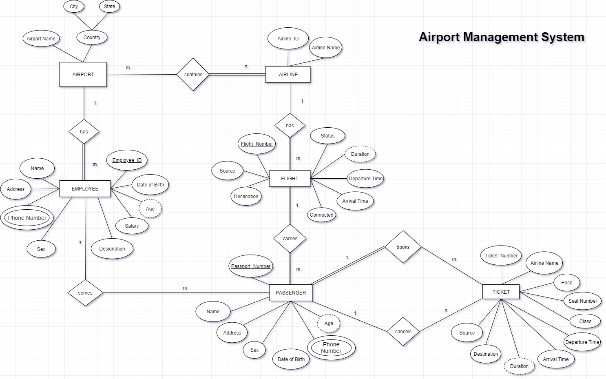
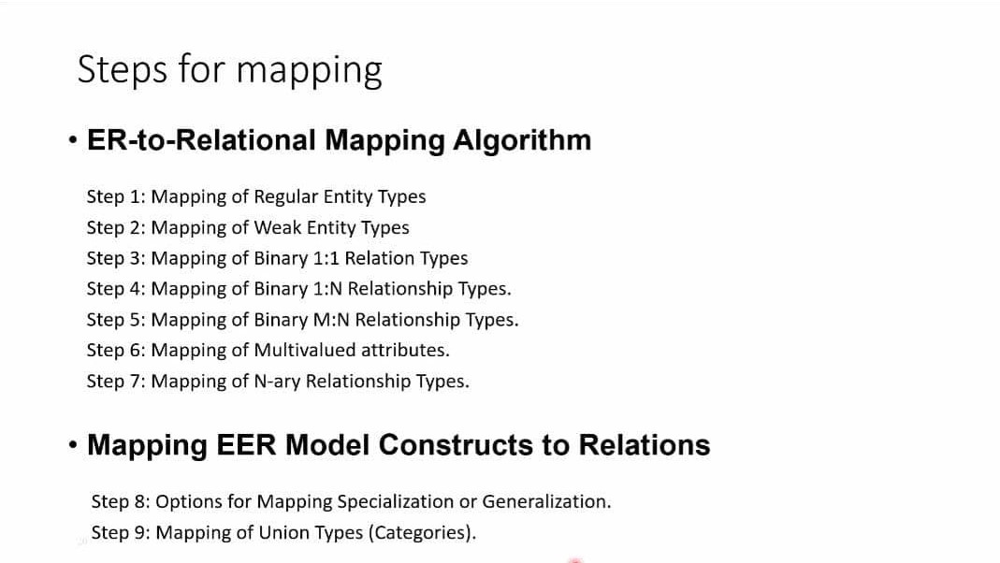

# Airport Database Management System

### _Entity Relationship Diagram_

Built using [Diagram Editor](https://www.diagrameditor.com/).

### Extended Entity Relationship (EER) Diagram

-   An EER Diagram would consist properties like Specialisation & Generalisation.
    -   Suppose, an employee in this system can be **_specialised_** into entities like:
        -   Administration
        -   Security
        -   Engineers
        -   Traffic Monitor
    -   And, different types of flights, like Airbus, Boeing can be **_generalised_** into one single entity _Flight_.

### _Steps to map (E)ER into a Relational Schema_

These steps are briefly described in [this PDF](<documentation/(E)ER-mapping-to-RelationalSchema.pdf>).

### _Relational Schema_

-   Mapping the above ER Diagram to a Relational Schema

